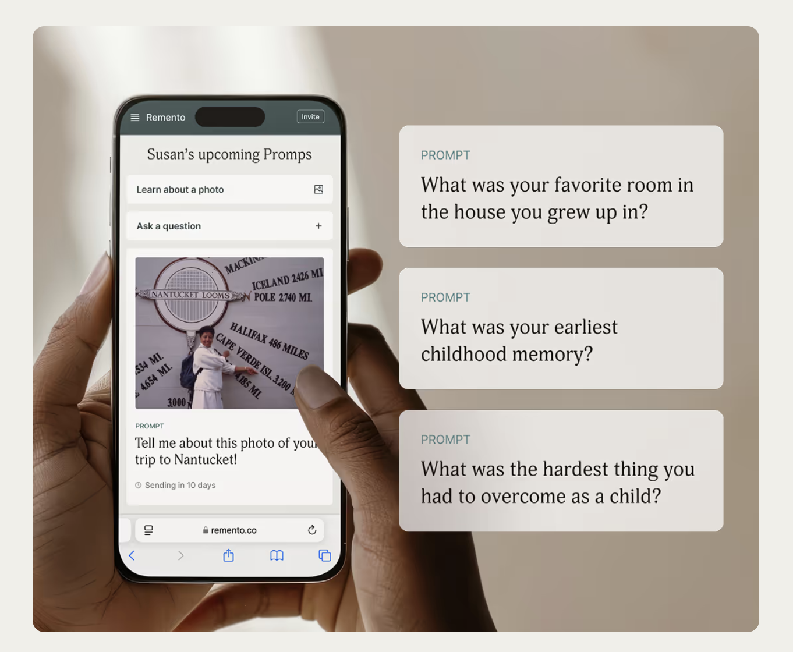
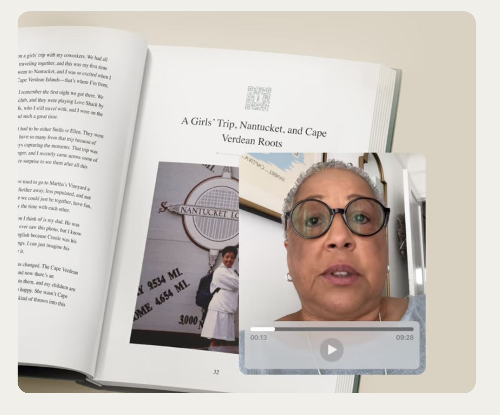

# IDEA LOCK · Build Sprint

The idea, in one line:

Charpai helps adults capture stories from aging family members  before they are lost, with the help of a live, guided interview, so they can uncover stories and create family heirlooms for generations to come.

Why me (at least 1 of 3: an audience that trusts me, years inside the workflow, data nobody else has):

I have always been a sucker for stories. My Twitter handle literally has "story" in it. Stories are how I evoke people's interest in things I'm discussing in my workshops and also within my extended family and friends.

People in my personal network trust me on stories and their value. They often bring up how I can surface stories in their lives that they have not thought about.

At work I have done field interviews for nonprofits and captured stories about farmers and about community members

## GOAL

The one goal they hire it for (money, time, status or life):

it is life

They'll hire this product to capture life stories from aging parents. Build a family heirloom.

Delta 4 (the steps today → the steps with my product):

### Today

Right now, if a grandchild has to do this, they would ask the grandparent a few questions. They would write it down, or they would capture the recording and share it with ChatGPT. ChatGPT would summarize or create a text story out of it. They will then need to work with ChatGPT to create a new design, edit and correct the story, and find a digitally publishable version of it and a physically printable version of it.

### With my product

1. **Start:** The adult child opens Charpai and selects starting prompts
2. **Interview:** They talk with their parent while AI helps them steer conversation and ask follow up questions.
3. **Create:** After the conversation, they receive a draft of the story book  and they can edit it.
4. **Share:** They are left with a digital story book  so their family can reminisce and spark more stories.

They receive a custom URL that has the storybook and the audio embedded in it.

### Better result

Interviewing is a skill that takes a lot of practice to develop. There are books and courses that help people get better at this. The live AI guidance is able to provide the same kind of support that an expert interviewer can offer when a family member asks questions. This cannot be done by a ChatGPT process.

Charpai notices when the interviewee talks about certain objects, spaces and people and And how the interviewee mentions them, along with the context of what the interviewee has shared, to generate cues for follow-up questions that help uncover a brillinat storyy

The sin it rides (optional):

MISSING

## USER

An adult child of an aging parent is the first user. It can also extend to grandparents.

The trigger (when the pain hits):

Death of an aged relative or one of the parents. O

Today's path, step by step (including not solving it at all):

Right now, if a grandchild has to do this, they would ask the grandparent a few questions. They would write it down, or they would capture the recording and share it with ChatGPT. ChatGPT would summarize or create a text story out of it. They will then need to work with ChatGPT to create a new design, edit and correct the story, and find a digitally publishable version of it and a physically printable version of it.

Who they trust on this decision:

MISSING

I haven't asked yet.

Would they pay? (what exists today that people pay for):

I have already spoken to four people in my network who were willing to pay money for it once the product is out.

These four are the ones who want to capture stories. Out of ten people I have pitched this product to

All of them.

I mentioned ₹400 without any physical storybook to be printed and shared.

They record audios or videos on phones, or they use some products that allow for capturing of these stories, but those products are not available in India. At least in the way that I'm envisioning this, there are story writing services that allow for families to share these things, and ghostwriters write detailed storybooks on them, but they're mostly for publishing rather than as a family heirloom.

## PRODUCT

Onboarding (how a first-time user feels the value fastest):

Pick a simple prompt, Something like asking the interviewee about how they got their first job, recording that, and then seeing that become a visual delight of a family heirloom

The core loop (user stories, written by me):

As an adult child, I want support and guidance to help me ask follow-up questions based on what my parent has said. That way, I can uncover stories I wouldn't know to ask about, or that my parent wouldn't know are hidden in what they've just shared.

The adult child needs dedicated time with the parent: 20 minutes to start with, to uncover at least one story.

As an adult child, I want to capture family stories so my family can learn about the grandparents and the lives they've lived.

That child wants to share the storybook with their kids and their family members. That becomes a topic of discussion and triggers more stories to be captured by extended family members. It also lets other family members share stories.

Coming back (optional):

That child wants to share the storybook with their kids and their family members. That becomes a topic of discussion and triggers more stories to be captured by extended family members. It also lets other family members share stories.

The AI-first part (onboarding, engagement or the core loop):

AI plays an active supportive role in helping the interviewer ask the right questions, ask the right follow-up, and nudge the interviewee to share without restraint

## MARKET

Tailwinds (where funding is going, what Google Trends shows, timing):

This is the perfect time for a product like this because families are now interested in capturing stories and have the propensity to spend on these.

Funding: MISSING

Google Trends: MISSING

Competitors (and the flows I liked, with screenshots and why):

Remento

From Reminto, I would borrow the process of capturing the stories using a digital platform where the audio gets recorded and how it gets published as an archive. One of the key differences here is that the interviewer is a family member instead of just an app that asks aging parents to just answer these, so the aging parent does not need to use any app for this.

Size and fit (how many people in my extended network fit):

The ones I can reach out to are easily over 40

Oh this is my close circle. If it is in the extended network, it is 200+

---

Shaktimaan, this is what I have thought about user, product and market. Lock it in.
